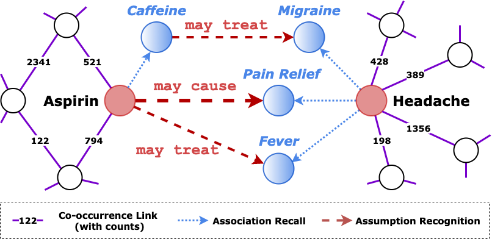
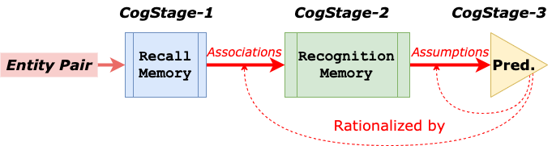

# X-MedRELA
Source code for ACL 2020 paper "[Rationalizing Medical Relation Prediction from Corpus-level Statistics](https://zhenwang9102.github.io/pdf/ACL2020_ZW_X_MedRELA.pdf)".

## Introduction

<p align="center">

</p>

<p align="center">

</p>

## Dataset

## Run

## Citation
```
@inproceedings{wang2020,
  title={Rationalizing Medical Relation Prediction from Corpus-level Statistics},
  author={Wang, Zhen and Lee, Jennifer and Lin, Simon and Sun, Huan},
  booktitle={Proceedings of the 58th Annual Meeting of the Association for Computational Linguistics},
  year={2020}
}
```
